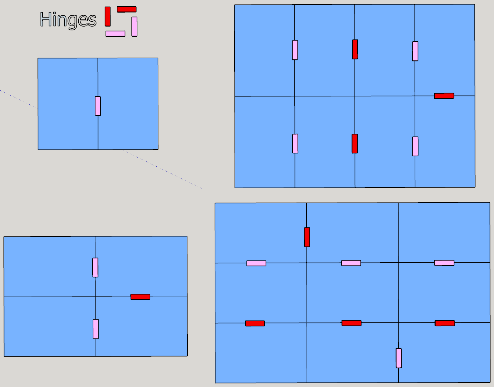

# Required Measurements, files and work steps for creating a custom TTR version

## Required designs:
- board map image (e.g. map of Middle Earth)
- board frame image, including counting strip (e.g. frame constructed from square tiles)
- Legend image -> ensure this includes exactly the required information (route length to points conversion)
- ***optional:*** *images for further legends including additional information (e.g. trains per player depending on player count, rules for special routes, longest route points etc.)*

**Graph Design on board**
- particle edge images for connections on map (6+1 or 8+1 colored versions of rectangles fitted to the train pieces)
- node image(s)
- font for text on board

**Designs for task cards**
- map image (may have a different aspect ratio or style than the board map)
- card frame image (design to add on top of the map image)
- points images to display on the cards (program includes scripts to generate these images from a given font)
- card backside image

## Required measurements:
For easier storage and transportation, we usually want a folding board made from several tiles attached together using some hinges.  
Since we often deal with images, it's recommended to get measurements in cm/ mm and pixels (px)

### Physical Board
- total size of board (e.g. 83.6 x 59.3 cm for 3x3 tiles cut from A4)
- desired margin around the printed area (e.g. 2mm on all sides) *I recommend including at least 2 mm margin all around. preferably 3-4 mm.*  
  *Due to the margin (and inner margin), not all tiles need the same printed area.*
- ***optional:*** *Aspect ratio of board with and without margin. The margin changes the aspect ratio!*
- ***optional:*** *Different inner margin between tiles (e.g. 0.5mm)*

#### Board Tiles
Find the size of paper you want to print the map on. This determines what size each board tile can be. Making board tiles larger would require seams on a tile which are difficult to line up well enough to look good. So the printed area on each tile should be smaller than the printable area of the paper.  
This also limits the board size. You likely won't want a board that has more than 9 tiles as that gets very thick and tricky to fold.

- printable size per board tile  
  

- Common folding patterns (hinges folding towards the screen marked pink, hinges folding away from the screen marked red)  
  

## Important decisions:
- **Folding pattern** for board tiles (e.g. 2x2, 3x3, 2x4)  
  -> influences the possible sizes of the board  
  -> choose pattern that can be cut down to required aspect ratio and size
- **train piece size** (e.g. 1x4 lego bricks: 3.2 x 0.8 cm, TTR Europe trains: 2.6 x 0.7 cm)  
  -> train size is the most important factor affecting the required size of the board. Large trains need either large boards or very short routes.
- **counting pieces size** (e.g. 2x2 lego bricks: 1.6 x 1.6 cm, TTR Europe counting pieces: 1.5 x 1.5 cm (circular))  
  -> counting piece size influences the required thickness of the counting strip and how many tiles can fit along the border.
- **card size** (e.g. 5.9 x 8.8 cm)  
  -> card size influences task card design. Ensure readability of location names on task cards by choosing a sufficient card- and font size, text layout on the cards and a readable font.  
  -> Use standard card sizes to make finding sleeves and storage options easier.
  - 63x88 mm or 2.5x3.5" (e.g. Pokémon TCG, Magic)
  - 65x100 mm (e.g. 7-Wonders)
  - 80x120 mm (e.g. Dixit)
  - 59x86mm (e.g. Yu-Gi-Oh, TTR Europe, TTR USA 1910)
- **Board size** 
